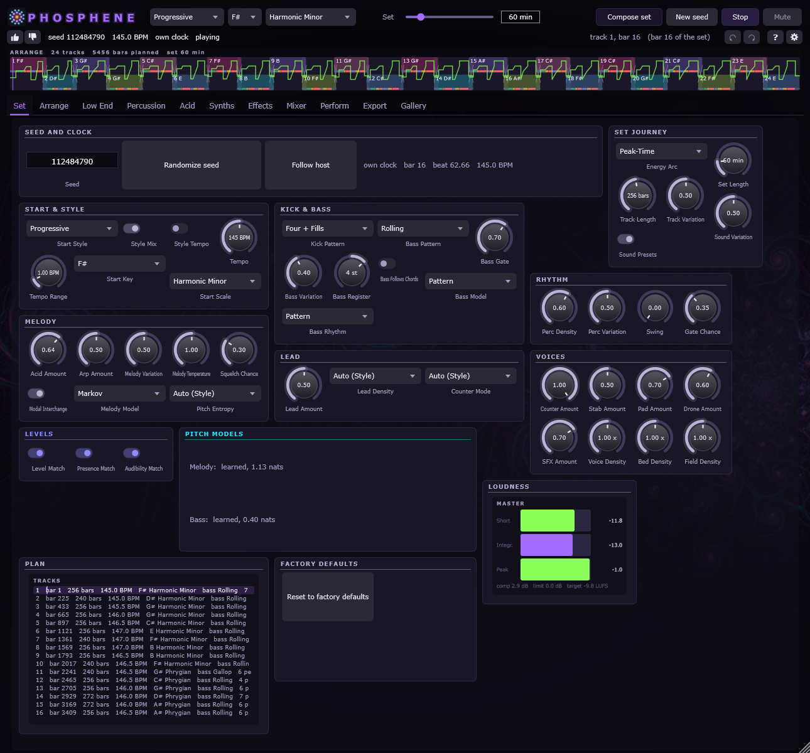
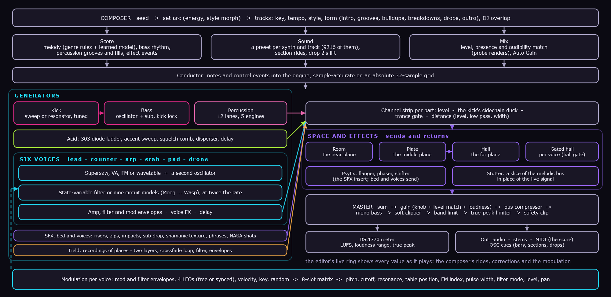
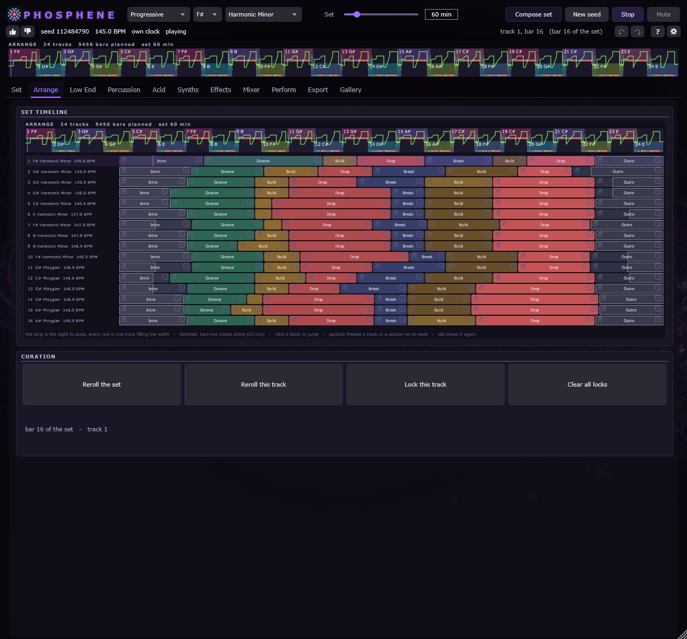
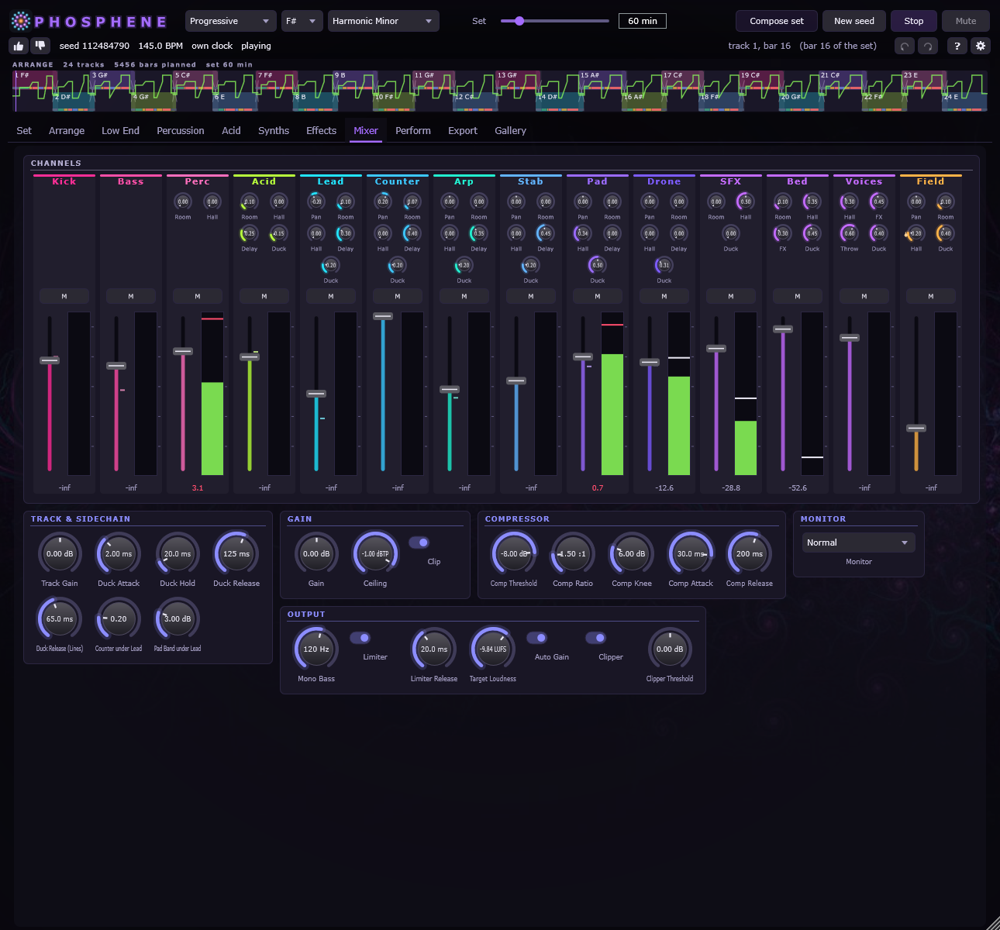
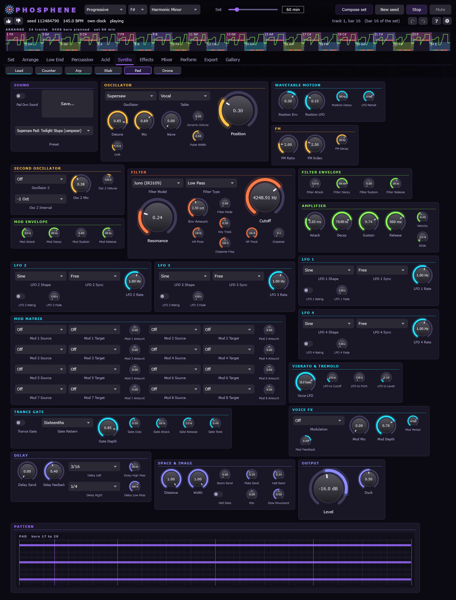
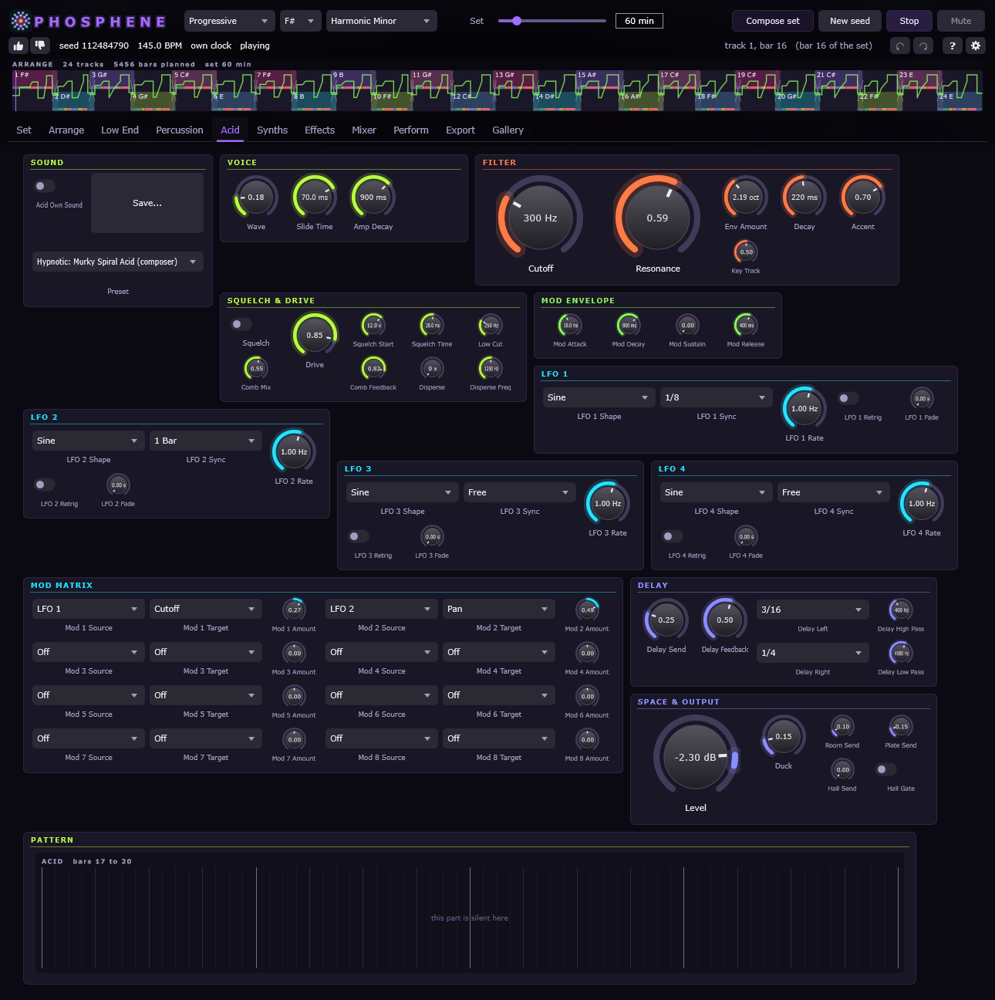

<p align="center">
  
</p>

# Phosphene — a generator for complete psytrance sets

Phosphene composes and synthesizes **whole psytrance sets** in real time: Goa, Full-On, Progressive,
Dark Forest and Hi-Tech, from a single seed, a style and an energy arc. It writes every track — key,
tempo, form, kick and rolling bass, percussion, 303 acid, leads, counter-leads, arpeggios, stabs,
pads, drones and effects — and plays it through its own synthesizers, mixer and mastering chain.
The same seed always gives the same night, so a set fits in seven lines of text.

**Standalone and VST3 plugin** for Windows (x64), and a native build for **Meta Quest**.
Generative music, algorithmic composition and sound design in one instrument; C++20, JUCE.
Licence: AGPL-3.0.



## Download

**[Phosphene-1.2.0-Setup.exe](https://github.com/reneweller-coding/Phosphene/releases/download/v1.2.0/Phosphene-1.2.0-Setup.exe)**
installs the standalone and the VST3 and fetches the data it needs (the wavetable pack, the two
learned models, the spoken phrases) and, if you leave the box ticked, the Field track's recordings
(2 GB, from the [field-data-1](https://github.com/reneweller-coding/Phosphene/releases/tag/field-data-1)
release). Nothing else has to be installed: the runtime is linked in.
There is a
**[portable zip](https://github.com/reneweller-coding/Phosphene/releases/download/v1.2.0/Phosphene-1.2.0-portable.zip)**
with everything in it for anyone who would rather not run an installer, and the
**[manual](https://github.com/reneweller-coding/Phosphene/releases/download/v1.2.0/Phosphene-Manual.pdf)** —
every tab as a picture, every parameter, and the reasons behind the design.

Requirements: Windows 10 or 11, a 64-bit processor with AVX2 (every x86-64 since 2013), and a VST3
host if you want the plugin. In a host Phosphene follows the transport and sends the score out as
MIDI, one channel per part.

## How it is put together



At the top the **composer**: a seed becomes a set arc, the arc becomes tracks, and each track becomes
a score, a choice of sounds and a mix. The **conductor** hands notes and control events to the
**engine** on an absolute grid of 32 samples, which is why a bar sounds the same whether the night
was played from the start or joined in the middle, and whatever block size a host uses. On the left
the generators, each in the colour of its tab; on the right the channel strips, three planes of space
and the master. Along the bottom the modulation of every voice.

## The instrument

* **A composer that knows the genre.** Every track is drawn from a grammar of intro, grooves,
  buildups, pre-drop breaks, drops, breakdowns and outro; an energy arc over the whole set moves
  loudness, density, register and tension. Five style profiles weight everything from tempo and
  kick pattern to chord moves. Melodies follow written genre rules first and a learned model
  (trained on statistics of a MIDI corpus) second; tracks overlap and hand over like a DJ mix.
* **Nine synthesizers, 9216 sound presets.** Kick (sweep or resonator, tuned to the key and
  phase-locked to the bass), rolling bass (oscillator and sub), a 303 acid on a diode ladder with
  accent, slide, squelch comb and disperser, and six polyphonic voices — lead, counter, arp, stab,
  pad, drone — with supersaw, VA, FM or wavetable oscillators (464 tables), a second oscillator, a
  state-variable filter or nine circuit-modelled filters (Moog ladder, Prophet, Juno, SEM, Xpander,
  diode ladder, Korg35, Polivoks, Wasp), amp, filter and mod envelopes, four LFOs and an eight-slot
  mod matrix. For every track the composer picks a preset per synth by style — 1024 per synth, in
  sixteen named groups — and evens their loudness out.
* **A twelve-lane percussion kit** with five synthesis engines, grooves and fills; **effects** —
  risers, zips, impacts, a sub drop, a shamanic bed, spoken phrases and NASA's sounds from space —
  with flanger, phaser, frequency shifter and stutter.
* **A Field track: a sampler for field recordings.** A place under the music — rainforest, a night
  of insects, rain, a river, a cave, a machine hall, the wind on Mars — from 120 recordings in 30
  categories and NASA's recordings, played as the original files: two layers, a loop joined by an
  equal-power crossfade (so any stretch of any recording loops), amp and filter envelopes, the
  synths' filter models and modulation, 160 presets. The composer draws a place per track by style
  (Dark Forest always has one) under intros, breakdowns and outros. The recordings are an optional
  2 GB download; without them everything else plays.
* **Mixed and mastered as it plays.** A channel strip per part with the kick's sidechain duck, trance
  gate and distance; a room, a plate and a hall for near, middle and far; a level, presence and
  audibility match measured by rendering parts of each track ahead of time; bus compressor, mono
  bass, soft clipper, a true-peak limiter on a loudness target, and BS.1770 metering.
* **The panel is yours.** Seventeen tabs generated from the engine's own parameter tables. The tab of a
  synth shows the preset the composer plays; a thin bright **live ring** on every knob and fader shows
  where a value plays away from where it stands — a section opening a filter, the level match, an
  LFO — and turning a knob takes the sound over. An arrange timeline locks or rerolls any track or
  section; four perform macros; a recorder; MIDI and set export.
* **Beyond the plugin.** An offline renderer (`phos_render`) that equals the plugin sample for sample,
  score cues over OSC for visuals (bars, sections, drops — made for
  [Kaleidoscope](https://github.com/reneweller-coding/KaleidoscopeEnhanced)), and the whole
  generator natively on Meta Quest, played with the hands.

| | |
|---|---|
|  |  |
| The arrange timeline: every track and section of the set, lockable | The mixer: a strip per part; the bright tick is the level the composer plays |
|  |  |
| A voice: oscillators, filter model, envelopes, LFOs and matrix | The acid: a 303 with squelch, disperser and delay |

## What it does not do

It does not play samples of instruments or loops: every sound except the spoken phrases and the
Field track's recordings of places is synthesized. It does not use a neural network to generate audio. It does not write lyrics, and it
does not imitate a named artist — the presets and styles are genres, not people.

The design and the literature behind each building block are in [docs/PLAN.md](https://github.com/reneweller-coding/Phosphene/blob/master/docs/PLAN.md)
(German); what each development round built, measured and decided is in the journal,
[docs/rounds/](docs/rounds/) (German, one file per month).

## Build

Visual Studio 2026 and CMake 3.22 or newer:

```bash
cmake -S . -B build -G "Visual Studio 18 2026" -A x64
cmake --build build --config Release
```

That builds one of six configurations this repository has. Before a release, or after anything in
`Core/` changes shape, build them all:

```powershell
powershell -File Tools\release\build_matrix.ps1
```

It configures and builds the desktop with and without the plugin, without AVX2, with the static
runtime, the root project through the Android NDK, and the Quest app itself, runs the three vector
builds, and prints a table of what came out and what each entry cost. Five minutes from empty build
directories on a 12900K, most of it the one entry that has JUCE in it. Nothing else builds the Quest
app or the Android configure, which is how both of them broke unnoticed once; the cheap half of that
check runs in every `ctest` as `questguard` (below).

### Plugin

The VST3 and the standalone are built with the rest and need JUCE 9.0.1, which CMake fetches from
GitHub on the first configure. To use a checkout you already have, copy it to `ThirdParty/JUCE`
(ignored by git) and it is taken from there. `-DPHOS_BUILD_PLUGIN=OFF` builds the tools alone.

```bash
cmake --build build --config Release --target Phosphene_Standalone Phosphene_VST3
build/Plugin/Phosphene_artefacts/Release/Standalone/Phosphene.exe
```

The VST3 is `build/Plugin/Phosphene_artefacts/Release/VST3/Phosphene.vst3`; copy it to
`C:\Program Files\Common Files\VST3`. In a host the playhead is the clock -- tempo and position
come from the transport, a jump is followed to the bar -- and the score's notes leave the plugin as
MIDI, one channel per part. The standalone has its own clock, a play and stop button, a loudness
meter, the plan of the set, a recorder and the exports.

Environment variables, for tests and documentation: `PHOS_MUTE=1` starts the standalone silent and it
never unmutes itself; `PHOS_SHOT=<file.png>` renders the editor at design size into a PNG and exits
(`PHOS_TAB=<index>` picks the tab, `PHOS_SHOT_ALL=<folder>` writes one picture per tab, see
[docs/screenshots](docs/screenshots)); `PHOS_SHOT_WAIT=<seconds>` is how long the composer is given to
plan before the pictures are taken, which the arrange timeline needs (26 seconds plans a whole
sixty-minute set); `PHOS_MANUAL=<folder>` writes those pictures plus a `manual.json` of the parameter
tables; `PHOS_PLAY=<seconds>` with `PHOS_RECORD=<file.wav>` plays for a while, records, and exits;
`PHOS_TRACE=1` makes the plugin report its transport and its composer on stderr, which is the way to
see inside it when a host has loaded it and it is silent.

### Manual

The manual is generated from the plugin itself -- the parameter tables and the groups each tab really
built, read back out of the running editor, plus one picture per tab -- with the prose in
`Tools/manual/chapters.txt`:

```bash
PHOS_MANUAL=docs/screenshots PHOS_SHOT_WAIT=26 build/.../Phosphene.exe
python Tools/manual/make_manual.py
```

That writes [docs/manual/Phosphene-Manual.html](docs/manual/Phosphene-Manual.html) and, through Edge
in headless mode, the PDF beside it. The generator refuses to call a manual complete when a parameter
exists in the engine but appears on no tab.

## Install

Releases are made by one script, from a clean checkout to the artefacts:

```powershell
powershell -File Deploy\build_release.ps1
```

It runs the build guard, configures and builds Release with the static MSVC runtime and AVX2 in a
tree of its own, runs `ctest` (the quick suite) in that configuration, renders a reference, prints the
manual out of the freshly built plugin, builds the Quest APK, stages everything into `Deploy\stage`,
checks the staging directory, and only then compiles the installer and the portable archive into
`Deploy\out`. Every step that fails stops the run; there is no switch that makes an installer out of
a build that did not pass its tests. It prints a manifest of every file with its size and SHA-256.

The package check ([`Tools/release/check_package.ps1`](Tools/release/check_package.ps1)) is what
stands between a green build and a bad release. It proves that every file the runtime needs is
there, that each data file is byte for byte the one in `Core/data`, that the APK really carries the
wavetable pack, that the version is the same in the renderer and in both Windows version resources,
that no binary still wants a Visual C++ runtime DLL, and — the one that covers the whole data path
at once — that the *staged* renderer, started from an unrelated directory and with both neural
models switched on, renders the reference bit for bit.

The installer puts the standalone, `phos_render.exe`, the manual, the APK and the data files into
`%ProgramFiles%\Phosphene`, and the VST3 bundle into the common VST3 folder. `library.phoswt`,
`melody.phosmdl` and `bass.phosmdl` are installed twice, beside the executables and inside the
bundle's `Contents\Resources`, because those are the two directories the artefacts declare as their
search path; without them the engine falls back to six built-in wavetables and to the Markov
composer and says so only on stderr. An update deletes the previous copies before installing rather
than writing over them, so a file that was renamed or dropped cannot linger.

Nothing built here is code-signed — there is no certificate on this machine — so Windows calls the
publisher unknown on first run. The manifest's hashes are what can be checked instead.

## Try it

```bash
build/Tools/render/Release/phos_render.exe --bars 32 --out out/loop.wav --midi out/loop.mid --report
```

```bash
build/Tools/render/Release/phos_render.exe --bars 32 --set "compose.bass_pattern=Triplet compose.key=A compose.scale=Double Harmonic kick.engine=Resonant" --out out/goa.wav
```

```bash
build/Tools/render/Release/phos_render.exe --minutes 60 --seed 2026 --tracks --sections --report \
    --set "compose.style=Goa compose.style_tempo=On compose.arc=Peak-Time compose.set_minutes=60" \
    --out out/night.wav --midi out/night.mid --save-set out/night.phosset
```

`--tracks` prints each track's key, tempo, patterns, sound recipe, chords, form, effects, level
corrections and, after the render, the loudness it really played; `--sections` lists every section of
the set. `--set-file night.phosset` plays a saved set again, `--lock track:3` and `--reroll track:5`
curate it (the units are set, track, section and lane). `--solo acid` (or kick, bass, perc, lead, arp,
pad, sfx) mutes everything else. `phos_selftest --only testDynamics` runs only the named self-test sections.
`--list` prints every parameter. `python Tools/inspect_wav.py out/loop.wav --bpm 145` draws the
render (waveform, one beat, spectrogram) and prints where in the beat the sub band is occupied.

## Meta Quest

The whole generator runs on the headset: the composer plans the set on a small core, the engine
synthesizes it on a big one, and the hands play it — pinch left for play/stop, pinch right for a
drop-out (held: the stutter), both hands for the next track, left hand height the filter sweep and
right hand height the gate depth: the grammar every generator of the family shares. In bridge mode
the app sends the hands to the desktop's Phosphene instead, which plays with them. Native
OpenXR, no game engine. Build and on-device checks: [Quest/README.md](https://github.com/reneweller-coding/Phosphene/blob/master/Quest/README.md).

```powershell
powershell -File Quest\fetch_thirdparty.ps1
powershell -File Quest\build_apk.ps1
adb install -r build-quest\PhospheneQuest.apk
```

`Quality::Quest` (`Core/include/phos/Quality.h`) is what the engine may spend there: the acid's
ladder at 1× instead of 2× (the bass keeps its oversampling), three unison oscillators instead of
seven, four pad voices instead of eight. `Engine::prepare` takes the level and defaults to Desktop,
so nothing else changes; `phos_render --quality quest` renders and benchmarks at it. On the desktop
the Quest level costs 16.9 % less for an eight-minute set with every part (7.2 % of a core against
6.0 %); **the number on the device is still open — no headset has been attached yet.**

## Tests

```bash
ctest --test-dir build -C Release -j 12 --output-on-failure  # the quick suite: about 90 tests, under half a minute
PHOS_TESTS="testPresence|mixaudit" ctest --test-dir build -C Release -j 6   # plus the long tests a change touches
PHOS_TESTS=all ctest --test-dir build -C Release -j 6         # everything (about half an hour; rarely needed)
```

A plain `ctest` is the quick suite. The long tests -- self-test sections over 10 s, which render whole tracks, and
`hosttest`, `hosttest.realhost`, `vst3test`, `cuecheck`, `mixaudit` -- are registered only when `PHOS_TESTS` names
them when ctest starts (`all`, or a regular expression their names match), so they run where a change concerns them
(the mix, the host, the cues), not on every commit.

Every self-test section is a ctest test of its own, `selftest.<name>`, taken from the `run("name", fn)`
table in `Tests/selftest.cpp` each time ctest starts (`phos_selftest --list`), so a new section needs no
CMake edit. Labels: `quick` (a few seconds), `slow`, `audio` (host and VST3 test: never muted, and each
runs alone because they check real-time behaviour), `full` (the old all-in-one `selftest`, registered only
with `PHOS_SELFTEST_FULL=1`). The seconds that decide quick and slow are in `Tests/selftest_tests.cmake`. `-j 6` leaves most of the machine to whoever works on it; a
dedicated machine can take more. By hand: `phos_selftest --list`, `phos_selftest --only testA,testB`
(exact names; `PHOS_ONLY` runs every section whose name occurs in the string, so
`PHOS_ONLY=testAcidColour` also runs `testAcid`).

`questguard` is the cheapest test in the suite and the only one that looks outside the desktop build:
it configures the root project for Android with its **default** options, asserts that the JUCE plugin
is off there (JUCE cannot cross-compile the host-side helper it needs, and its error names the
compiler rather than the cause), and compiles every `Quest/src/*.cpp` with the NDK's own clang in
syntax-only mode. Nothing else in `ctest` builds those; `Quest/src/main.cpp` had not compiled since
Phase 5 before this existed. Five seconds on this machine, and it reports itself as skipped, with the
reason, on a machine without the NDK or without `ThirdParty` rather than failing.

`phos_hosttest` measures the plugin around the engine: rates and block sizes no one develops at,
blocks that change size in the middle of a set, parameters written from another thread, a transport
that starts, jumps and stops, a state that comes back exactly as it went out, and every tab laid out
and painted. Its oracle is the offline renderer: with its own clock the plugin has to produce the
same samples `phos_render` produces, bit for bit.

`phos_vst3test` goes one step further and loads the **built VST3 off the disk**, the way a DAW loads
it: the module, the factory, an instance, the parameter list, a transport, the MIDI it produces, the
state, the editor, and the teardown. That is the part of pluginval that can live in the repository.
pluginval itself is not in the repository (it is a binary); fetched from Tracktion's releases and run
as `pluginval --strictness-level 10 --timeout-ms 900000 --validate <the .vst3>`, version 1.0.4 passes
all 25 of its test sections.

`phos_selftest` measures every building block against independently derived values: the ladders'
analytic responses (the diode ladder against Zavalishin's transfer function and its self-oscillation
at k = 17), the supersaw against Szabo's JP-8000 tables, FM sidebands against Bessel functions, the
constrained Markov sampler against brute-force enumeration, pad voicings against exhaustive search, the
compressor against Giannoulis et al., the limiter's output against an exact band-limited true peak, the
hall's decay time, an eight-minute track against the loudness target, the tempo integral, the half-band
stopband, oscillator aliasing, the kick's pitch sweep, sample-accurate event timing, bit-identical
output across block sizes, the MIDI round trip and BS.1770 loudness. The form is measured on a rendered
track against the findings of Solberg and Dibben (2019): the breakdown at least 6 dB under the core
before it, the buildup rising over every four-bar window, the kick-and-bass band 20 dB down in the
breakdown, beat 4 of the pre-drop break 30 dB under a core beat, and the drop at least as loud and as
bright as what stood before the break. `phos_vectest` runs in three builds (AVX2, NEON through an x86 shim, scalar) and
requires every lane of the vectorised DSP to equal the scalar computation bit for bit.

## Layout

| Path | Contents |
|---|---|
| `Core/` | framework-free engine, `phos::` namespace |
| `Quest/` | the Meta Quest app: OpenXR, GLES 3, Oboe, no Gradle |
| `Tools/render/` | `phos_render`: offline render, MIDI export, benchmark |
| `Tools/inspect_wav.py` | pictures and measurements of a render |
| `Tools/ref_*.py` | measurements of reference recordings: bass slots, percussion grid, band balance, sweeps, tempo per style and the shape of a break |
| `Tools/corpus/` | `build_corpus.py`: melodic statistics from a local MIDI corpus (the MIDI files stay local), memorisation check |
| `Plugin/` | JUCE 9 VST3 and standalone: processor, editor, layout engine, arrange timeline, perform macros |
| `Tools/manual/` | `make_manual.py` and the manual's prose: HTML and PDF out of the plugin's own tables |
| `Tools/release/` | the build guard (`quest_guard.cmake`), the target matrix and the package check |
| `Deploy/` | `build_release.ps1`, the Inno Setup script, the icon; `stage/` and `out/` are made by the script |
| `Tests/` | self test, host test, VST3 test, vector-path tests, NEON shim, the build guard |
| `docs/screenshots/` | one picture per tab of the editor |
| `docs/` | plan, Doxygen configuration |

Some modules are copied from [Noctuary](https://github.com/reneweller-coding/Noctuary) and name their
origin and commit in their file header.

## Licence

AGPL-3.0, as Noctuary.
